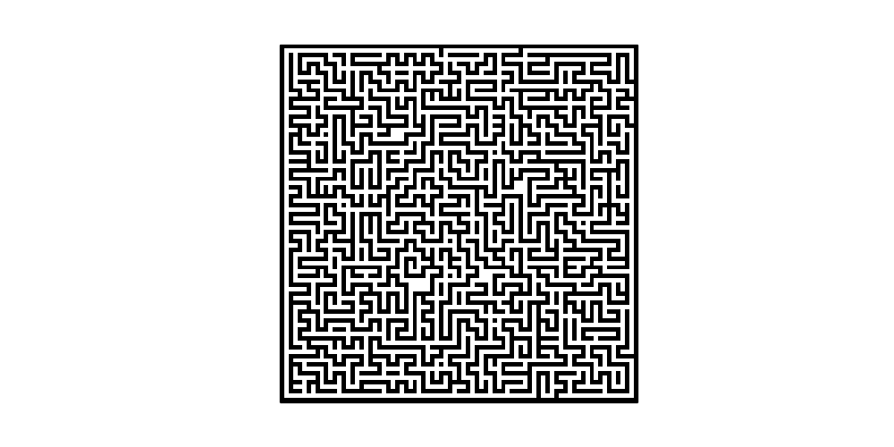

# Project 1 Informed Search

## 1. Problem
You are given a separate maze file in text format. In this maze, you can go up, down, left, or right. The maze is 81*81 binary matrix where each line in the file represents a row, and its values are separated with a space. 1 indicates a block that you cannot pass. 0 indicates a clear space that you can pass from.
You should implement a program using Informed Search that reads this maze and takes any two points (start and end indices) as inputs and tells whether there is a path in this maze between such points. Please note that the index starts at 0 in the following points. For example, given the start point (1,1) and the end point (1, 8), your program outputs ‘YES’ if there exists at least one path between those two points and ‘NO’ if no path exists.

## 2. Graph Search
Using Graph search method to solve this problem   
### State space   

1. maze[81][81]: has a value space {0, 1}.   
2. path: a path stack, the element is node (x, y).   
3. visited: a hash table recording the visited nodes set.   

### Search strategy

When searching for the next step, use (x-1, y) to present upwards, use (x+1, y) to present backwards, use (x, y-1) to present towards left, use (x, y+1) to present towards right.
### Border
0 <= x <= 81; 
0 <= y <= 81; 
### Start state & Goal state
When the start point is equal to the end point, the search returns true and the path is also found.
